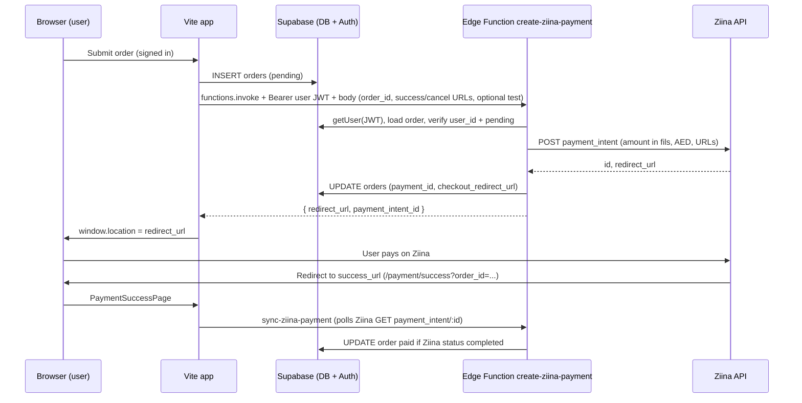

# Payment gateway (Ziina) — handoff for ChatGPT analysis & debugging

**Repository:** `social-spark-growth` (Vite + React + Supabase).  
**Provider:** [Ziina](https://ziina.com) — API base `https://api-v2.ziina.com/api`, endpoint `POST /payment_intent`.  
**Pattern:** Amount and order ownership are enforced **server-side** in a Supabase Edge Function; the browser only receives a `redirect_url` and sends **redirect URLs** built from `window.location.origin` (similar to a separate “pro-run-store” reference app).

Paste this whole file into ChatGPT (or another assistant) along with **your exact error message**, **HTTP status**, and **where it fails** (browser toast, Network tab, Supabase function logs).

---

## What to help me debug

1. Trace the expected flow and say where it could break.
2. Map my **symptom** (e.g. 401, 400 “allowed domain”, 502 from Ziina, “Not signed in”, redirect loop) to **likely causes** and **concrete checks** (env, deploy, Ziina dashboard, code path).
3. Suggest **minimal** code or config changes only if something is inconsistent with the described contract.

---

## End-to-end flow



---

## Key files (repo)

| Area | Path |
|------|------|
| Build payment request body | `src/lib/ziinaCheckout.ts` → `buildZiinaPaymentBody(orderId)` |
| Test mode flag | `src/lib/paymentTestMode.ts` → `isPaymentTestMode()` (DEV **or** `VITE_PAYMENT_TEST_MODE=true`) |
| Invoke Edge Function with session | `src/lib/supabaseFunctions.ts` → `invokeAuthedFunction` |
| Start checkout after order insert | `src/pages/OrderPage.tsx` |
| Retry checkout | `src/pages/DashboardPage.tsx` → `startCheckout` |
| After Ziina redirect | `src/pages/PaymentSuccessPage.tsx` → calls `sync-ziina-payment` (must be **logged in**) |
| Cancel route | `src/pages/PaymentCancelPage.tsx`, `src/App.tsx` routes `/payment/success`, `/payment/cancel` |
| Create intent | `supabase/functions/create-ziina-payment/index.ts` |
| Poll / sync status | `supabase/functions/sync-ziina-payment/index.ts` |
| CORS helper | `supabase/functions/_shared/cors.ts` |
| JWT at gateway | `supabase/config.toml` → `[functions.create-ziina-payment] verify_jwt = false` (and same for `sync-ziina-payment`) — **auth is still checked inside the function** via `Authorization: Bearer <user_access_token>`. |

---

## Environment variables

### Vite (public — `.env` / hosting env)

| Variable | Role |
|----------|------|
| `VITE_SUPABASE_URL` | Supabase project URL |
| `VITE_SUPABASE_ANON_KEY` | Anon key (browser) |
| `VITE_SITE_URL` | Optional; used elsewhere (e.g. auth redirects), not required for Ziina if client sends URLs |
| `VITE_PAYMENT_TEST_MODE` | If `true`, client sends `test: true` to Edge Function for Ziina test intents |

### Supabase Edge Function **secrets** (Dashboard → Edge Functions → Secrets or `supabase secrets set`)

| Secret | Role |
|--------|------|
| `SUPABASE_URL` | Usually auto-injected |
| `SUPABASE_ANON_KEY` | Usually auto-injected |
| `SUPABASE_SERVICE_ROLE_KEY` | Usually auto-injected; used to read/update `orders` |
| `ZIINA_API_KEY` | **Required** — Ziina Bearer token |
| `ZIINA_TEST_MODE` | If `true`, Edge Function adds Ziina `test: true` even if client does not |
| `SITE_URL` | **Optional** if client always sends `success_url` / `cancel_url`. If client omits them, **required** (no trailing slash) to build default redirect URLs |
| `ZIINA_ALLOWED_DOMAINS` | Optional comma-separated hostnames **without** `https://` (e.g. `app.netlify.app,www.example.com`) — used to validate client-supplied redirect URLs |

**Redirect URL allowlist logic (create-ziina-payment):** host must match `localhost`, `127.0.0.1`, any host from `ZIINA_ALLOWED_DOMAINS`, or the hostname parsed from `SITE_URL` (if valid URL).

---

## Edge Function: `create-ziina-payment`

- **Method:** `POST`, JSON body.
- **Headers:** `Authorization: Bearer <supabase_user_access_token>` (required).
- **Body (typical from app):**
  - `order_id` (UUID string) — **required**
  - `success_url`, `cancel_url` — **recommended** (built from `window.location.origin` in `buildZiinaPaymentBody`)
  - `failure_url` — optional; defaults to `cancel_url` if omitted
  - `test` — optional boolean; combined with `ZIINA_TEST_MODE` secret
- **Server rules:**
  - User must match `orders.user_id`.
  - Order `status` must be `pending`.
  - Amount from DB: `aedToFils(amount) = round(amount * 100)` — **`orders.amount` is treated as AED**; minimum **2 AED** → **200 fils**.
- **Ziina request:** `POST https://api-v2.ziina.com/api/payment_intent` with JSON including `amount` (fils), `currency_code: "AED"`, `success_url`, `cancel_url`, `failure_url`, `message`, optional `test`.
- **Success response:** `{ redirect_url, payment_intent_id }` (client uses `redirect_url`).

### Typical HTTP errors (function response)

| Status | Meaning / where to look |
|--------|-------------------------|
| 401 | Missing/invalid `Authorization`, or `getUser` failed — session expired, wrong token |
| 400 | Bad JSON, missing `order_id`, redirect hostname not allowed, or neither client URLs nor `SITE_URL` set |
| 403 | Order belongs to another user |
| 404 | Order not found |
| 400 | Order not `pending` |
| 400 | Order amount under 2 AED (minimum 200 fils) |
| 500 | Missing Supabase env, DB update error |
| 502 | Ziina returned error or non-JSON — read `message` / `detail` in body |

---

## Edge Function: `sync-ziina-payment`

- **Method:** `POST`, body `{ order_id }`.
- **Headers:** Same user JWT as above.
- Loads `orders.payment_id`, `GET https://api-v2.ziina.com/api/payment_intent/:id`.
- If Ziina `status === "completed"`, updates order to `paid` (and progress, `paid_at`).
- **Payment success page** retries up to ~8 times with 1s delay — if user is **not logged in**, sync does not run until `useAuth` resolves; if session is missing, user may see errors or stuck state.

---

## Common failure modes (checklist)

1. **`ZIINA_API_KEY` missing or wrong secret name** → 500 “Payment provider not configured” or Ziina 401/403.
2. **Redirect URL hostname rejected** → 400 “must use an allowed domain” — fix `ZIINA_ALLOWED_DOMAINS` or `SITE_URL` hostname to include **exact** host user sees (e.g. Netlify preview subdomain).
3. **`SITE_URL` unset and client not sending URLs** → 400 asking for `SITE_URL` or client URLs (current app **does** send URLs from origin — if an old client/build does not, this triggers).
4. **Session / “Not signed in”** before `invokeAuthedFunction` — user JWT missing.
5. **Order not pending** (double submit, already paid) → 400 “not awaiting payment”.
6. **Wrong amount unit in DB** — if `orders.amount` is already fils or wrong column, Ziina gets wrong charge or below minimum.
7. **Functions not deployed** or **old bundle** — redeploy `create-ziina-payment` and `sync-ziina-payment`; ensure `config.toml` `verify_jwt` settings are deployed.
8. **Ziina dashboard / account** — domain whitelist, live vs test keys, API version mismatch.
9. **Success page** — user lands from Ziina but **auth session lost** (third-party cookies, different subdomain) → sync fails or never runs as expected.

---

## Manual E2E test playbook

Use this to verify the **happy path** and to **split** frontend vs Edge Function vs Ziina issues.

### Raw `fetch` / `curl` and Supabase

Invocations that bypass `supabase-js` should send **both**:

- `Authorization: Bearer <user_access_token>` (from `getSession()` — the **user** JWT, not the anon key)
- `apikey: <VITE_SUPABASE_ANON_KEY>` (project anon key — same value as in the Vite app)

Without `apikey`, the gateway may reject the request before your function runs.

Replace placeholders:

- `<PROJECT_REF>` — subdomain only, e.g. `pecwhbsaxfikglxppcyc`
- `<ORDER_ID>` — UUID of a `pending` order for the logged-in user, `amount` ≥ 2 (AED)
- `<USER_JWT>` — `access_token` from `supabase.auth.getSession()` for that user

---

### 1. Minimal end-to-end test (browser console)

**Pre-conditions**

- User is logged in in the app.
- Row in `orders`: `id = <ORDER_ID>`, `status = pending`, `amount >= 2` (AED), `user_id` = that user.

**Getting `supabase` in the console:** The app does not expose the client globally. Pick one:

- **Easiest:** DevTools → **Network** → submit checkout from the UI → select `create-ziina-payment` → **Copy as fetch** → paste and edit the body/`order_id`; or
- **Temporary dev-only:** expose the client, e.g. `import.meta.env.DEV && Object.assign(window, { __sb: supabase })` next to `createClient` (remove before production).

**Step — call the Edge Function**

```javascript
const supabase = window.__sb; // if you exposed it in dev; otherwise use Copy as fetch from Network
const { data: { session } } = await supabase.auth.getSession();
if (!session?.access_token) throw new Error("No session");

const projectUrl = "https://<PROJECT_REF>.supabase.co";
const anonKey = "<VITE_SUPABASE_ANON_KEY>"; // from .env (same as the app)

const orderId = "<ORDER_ID>";
const origin = window.location.origin;

const res = await fetch(`${projectUrl}/functions/v1/create-ziina-payment`, {
  method: "POST",
  headers: {
    "Content-Type": "application/json",
    Authorization: `Bearer ${session.access_token}`,
    apikey: anonKey,
  },
  body: JSON.stringify({
    order_id: orderId,
    success_url: `${origin}/payment/success?order_id=${encodeURIComponent(orderId)}`,
    cancel_url: `${origin}/payment/cancel?order_id=${encodeURIComponent(orderId)}`,
  }),
});

const data = await res.json().catch(() => ({}));
console.log(res.status, data);
```

**Expected**

- `200` and body like `{ redirect_url: "https://...", payment_intent_id: "..." }`.

**Interpretation**

- Works here → backend + secrets + domain allowlist OK for this origin; suspect **frontend** flow (`invokeAuthedFunction`, order insert, navigation).
- Fails here → **Edge Function**, **secrets**, **Ziina**, or **domain allowlist** (fix before debugging React).

---

### 2. Isolated Edge Function test (curl / Postman)

No frontend — only JWT + JSON.

```bash
curl -sS -X POST "https://<PROJECT_REF>.supabase.co/functions/v1/create-ziina-payment" \
  -H "apikey: <SUPABASE_ANON_KEY>" \
  -H "Authorization: Bearer <USER_JWT>" \
  -H "Content-Type: application/json" \
  -d '{
    "order_id": "<ORDER_ID>",
    "success_url": "http://localhost:5173/payment/success?order_id=<ORDER_ID>",
    "cancel_url": "http://localhost:5173/payment/cancel?order_id=<ORDER_ID>"
  }'
```

**Note:** `success_url` / `cancel_url` must include `order_id` if you rely on `PaymentSuccessPage` query params. Localhost is allowlisted by default in the function.

| HTTP status | Likely meaning |
|-------------|----------------|
| 200 | Backend path OK |
| 401 | Auth: bad/missing JWT or `apikey` |
| 400 | Validation: body, domain not allowed, order state, amount under 2 AED |
| 502 | Ziina API error (check response body + Edge logs) |
| 500 | Supabase misconfig / DB update error |

---

### 3. Unit-style checks (logic only — pseudo)

Simulates rules enforced in `create-ziina-payment` (run in Node or mentally):

```javascript
const mockOrder = { id: "…", user_id: "user_1", amount: 10, status: "pending" };
const mockUser = { id: "user_1" };

console.assert(mockOrder.user_id === mockUser.id);
console.assert(mockOrder.status === "pending");
const fils = Math.round(Number(mockOrder.amount) * 100);
console.assert(fils >= 200, "min 2 AED = 200 fils");
```

---

### 4. Critical failure cases (manual negative tests)

Run one at a time; compare to the **Typical HTTP errors** table above.

| # | Test | Expected |
|---|------|----------|
| 1 | Omit `Authorization` (keep `apikey`) | 401 Unauthorized |
| 2 | `"success_url": "https://evil.com/success"` (with valid order) | 400 — allowed domain / validation |
| 3 | Order with `amount` = 1 (AED) | 400 — under minimum 2 AED |
| 4 | `order_id` of another user’s order | 403 Forbidden |
| 5 | Unset `ZIINA_API_KEY` in Supabase secrets | 500 — payment provider not configured |
| 6 | Invalid Ziina key | 502 — Ziina error (see logs / `detail`) |

---

### 5. Success page — `sync-ziina-payment` (manual)

After Ziina redirects back, the app polls **`sync-ziina-payment`**. To test the function alone (full URL, not a relative `/functions/...` path):

```javascript
const projectUrl = "https://<PROJECT_REF>.supabase.co";
const anonKey = "<SUPABASE_ANON_KEY>";
const { data: { session } } = await supabase.auth.getSession();

const res = await fetch(`${projectUrl}/functions/v1/sync-ziina-payment`, {
  method: "POST",
  headers: {
    "Content-Type": "application/json",
    Authorization: `Bearer ${session.access_token}`,
    apikey: anonKey,
  },
  body: JSON.stringify({ order_id: "<ORDER_ID>" }),
});
console.log(res.status, await res.json());
```

**After Ziina marks the intent completed:** expect JSON with `synced: true` / `status: paid` and DB: `orders.status = paid`, `paid_at` set.

---

### 6. High-probability real bugs (this repo)

| Issue | Symptom | What to verify |
|-------|---------|----------------|
| **Auth lost after redirect** | Success page stuck; sync never completes | Same **site** for app and redirects (no `www` vs apex mismatch). `persistSession` / storage not cleared. `getSession()` on success URL. |
| **Domain / preview host** | 400 allowed domain | Add the **exact** hostname (e.g. `deploy-preview-123--mysite.netlify.app`) to `ZIINA_ALLOWED_DOMAINS`, **or** add parent host `netlify.app` (this repo treats `host.endsWith('.netlify.app')` when `netlify.app` is listed — do **not** use `*.netlify.app` as a literal secret value). |
| **Stale deployment** | Fix deployed but behavior unchanged | `supabase functions deploy create-ziina-payment` and `sync-ziina-payment`. |
| **Amount unit** | Wrong charge or validation errors | `orders.amount` stored as **AED**; only the Edge Function multiplies by 100 for fils. |

---

### 7. Fast debug order (recommended)

1. Manual `create-ziina-payment` call (**section 1 or 2**) with `apikey` + user JWT.
2. Supabase **Edge Function logs** for the same request id / timestamp.
3. Browser **Network** tab for the real checkout attempt (status + JSON body).
4. Confirm **secrets** names (not values): `ZIINA_API_KEY`, optional `SITE_URL`, `ZIINA_ALLOWED_DOMAINS`.
5. Confirm **redirect hostname** matches allowlist.
6. On success URL, confirm **`getSession()`** still returns a user.

---

## What I should attach when asking for help

- [ ] Full **error text** from UI toast or thrown `Error`.
- [ ] Browser **Network** entry for `.../functions/v1/create-ziina-payment` (status, response JSON).
- [ ] Supabase **Edge Function logs** for the same timestamp.
- [ ] Confirm **host** in address bar when starting checkout (must be allowlisted).
- [ ] Whether **`VITE_PAYMENT_TEST_MODE`** / **`ZIINA_TEST_MODE`** are on and whether using **test** vs **live** Ziina key.
- [ ] Redacted list of secrets **names** set in Supabase (not values), especially `ZIINA_API_KEY`, `SITE_URL`, `ZIINA_ALLOWED_DOMAINS`.

---

## Deploy commands (reference)

```bash
supabase functions deploy create-ziina-payment
supabase functions deploy sync-ziina-payment
# Secrets (example — do not commit real values)
supabase secrets set ZIINA_API_KEY=... SITE_URL=https://your-domain.com
supabase secrets set ZIINA_ALLOWED_DOMAINS=your-domain.com,www.your-domain.com
```

---

## Explicit question for the assistant

Given the architecture above, **given my symptoms and logs (I will paste below)**, list the **top 3 most likely root causes** in order, **how to verify each in under 5 minutes**, and the **smallest fix** (config vs code) for each.

**My symptoms / logs:**

_(Paste here: error messages, HTTP status, response body, screenshots text, etc.)_
